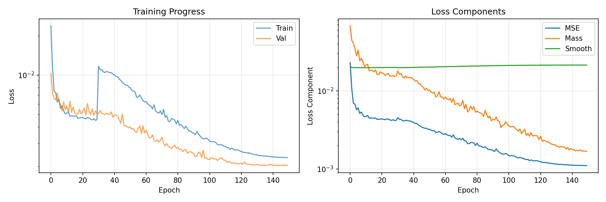
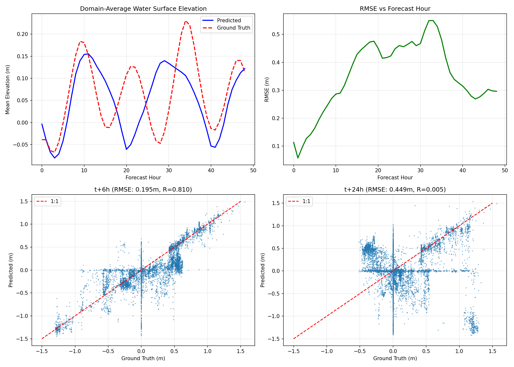
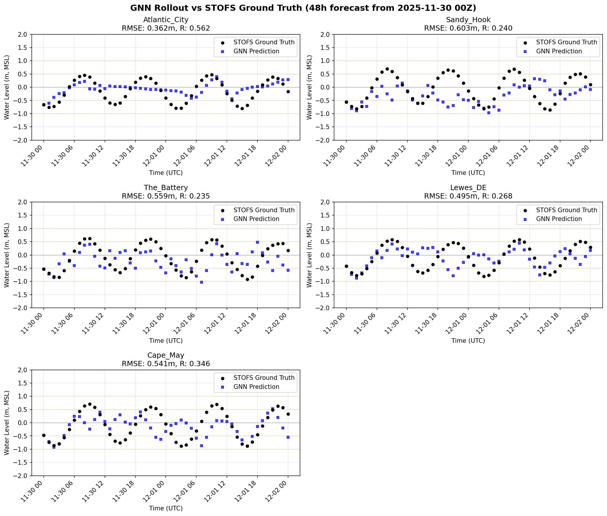

# STOFS-GNN: Graph Neural Network Surrogate for Storm Surge Forecasting

A deep learning surrogate model for NOAA's Surge and Tide Operational Forecast System (STOFS), enabling rapid ensemble storm surge predictions using Graph Neural Networks built on the MeshGraphNet architecture.

## Highlights

- **~100x faster** than full numerical model for 48-hour forecasts
- **50-member ensemble** in ~4 minutes on RTX 3050 Ti
- **Physics-informed** architecture with SWE-inspired message passing
- **Full 2D spatial fields** (~25,000 nodes) covering the U.S. East Coast
- **GFS atmospheric forcing** integrated as dynamic node features

## Results

### Training Convergence



*Left: Training and validation loss over 150 epochs. Right: Loss components (MSE, Mass conservation, Smoothness).*

### Rollout Performance

| Lead Time | RMSE (m) | Correlation |
|-----------|----------|-------------|
| t+1h      | 0.057    | -     |
| t+6h      | 0.195    | 0.81  |
| t+12h     | 0.317    | -     |
| t+24h     | 0.449    | 0.01  |
| t+48h     | 0.296    | -     |



### Station Validation (48h forecast)

| Station | RMSE (m) | Correlation |
|---------|----------|-------------|
| Atlantic City | 0.40 | 0.45 |
| Sandy Hook    | 0.59 | 0.36 |
| The Battery   | 0.46 | 0.53 |
| Lewes, DE     | 0.51 | 0.30 |



## Installation

```bash
git clone https://github.com/mansurjisan/stofs_surrogate.git
cd stofs_surrogate

pip install -r requirements.txt

# Install PyTorch Geometric
pip install torch-geometric
pip install pyg_lib torch_scatter torch_sparse -f https://data.pyg.org/whl/torch-2.0.0+cu118.html

# Install package
pip install -e .
```

## Quick Start

### 1. Download STOFS Data

```bash
python scripts/download_stofs.py --start-date 20240101 --end-date 20240630
```

### 2. Preprocess

```bash
python scripts/preprocess_25k_v2.py
python scripts/preprocess_25k_gfs_v2.py
```

### 3. Train

```bash
python scripts/train_25k_ursa_h100_v2.py \
    --epochs 150 \
    --batch_size 4
```

### 4. Ensemble Inference

```bash
python scripts/ensemble_inference.py \
    --preprocessed data/processed/processed_20251128.npz \
    --n_members 50 \
    --forecast_hours 48
```

## Project Structure

```
stofs_surrogate/
├── stofs_surrogate/              # Main Python package
│   ├── models/gnn.py             # MeshGraphNet-based GNN architecture
│   ├── data/                     # Dataset, mesh, preprocessing
│   ├── training/trainer.py       # Training loop
│   ├── inference/                # Ensemble forecaster, station extraction
│   └── visualization/plots.py   # Plotting utilities
├── scripts/                      # Active scripts (~26 files)
│   ├── train_25k_ursa_h100_v2.py # Production training script
│   ├── preprocess_25k_v2.py      # Data preprocessing
│   ├── ensemble_inference.py     # Ensemble forecasting
│   ├── generate_rollout.py       # Deterministic rollout
│   ├── download_stofs.py         # STOFS data download
│   ├── visualize_*.py            # Visualization scripts
│   ├── ursa_longrange_scripts/   # Long-range forecast & SLURM jobs
│   └── archived/                 # Historical development scripts
├── configs/                      # YAML configuration files
├── docs/                         # Documentation & paper draft
│   ├── GNN_STOFS_PAPER_DRAFT.md
│   ├── TRAINING_WORKFLOW.md
│   ├── ROLLOUT_WORKFLOW.md
│   └── URSA_SETUP_GUIDE.md
├── tests/                        # Unit tests
├── pyproject.toml
├── setup.py
└── requirements.txt
```

## Data Access

- **STOFS Global**: Available from [NOAA CO-OPS](https://tidesandcurrents.noaa.gov/) and NOAA S3 buckets
- **GFS Forcing**: Downloaded from NOAA NOMADS / NCAR RDA
- **Preprocessed data**: Contact authors for preprocessed training datasets

## Model Architecture

```
Input: [water_level_t, static_features, GFS_forcing]
    → Node Encoder (MLP)
    → 6× SWE-Inspired Graph Blocks (message passing)
    → Decoder (MLP)
    → water_level_{t+1}
```

| Parameter   | Value   |
|-------------|---------|
| Hidden dim  | 96      |
| GNN layers  | 6       |
| Mesh nodes  | ~25,000 |
| ETA_SCALE   | 2.0     |
| WIND_SCALE  | 15.0    |

## Requirements

- Python 3.10+
- PyTorch 2.0+
- PyTorch Geometric 2.4+
- CUDA-capable GPU (8GB+ VRAM recommended for training)

## License

This software was developed by NOAA and is in the public domain (17 U.S.C. § 105). See [LICENSE](LICENSE) for details.

## Citation

```bibtex
@software{stofs_surrogate,
  author = {Jisan, Mansur Ali},
  title = {STOFS-GNN: Graph Neural Network Surrogate for Storm Surge Forecasting},
  year = {2025},
  url = {https://github.com/mansurjisan/stofs_surrogate}
}
```

## Acknowledgments

- NOAA/NOS for STOFS operational data
- MeshGraphNet (Pfaff et al., 2021) as the foundational GNN architecture
- PyTorch Geometric team for GNN framework
