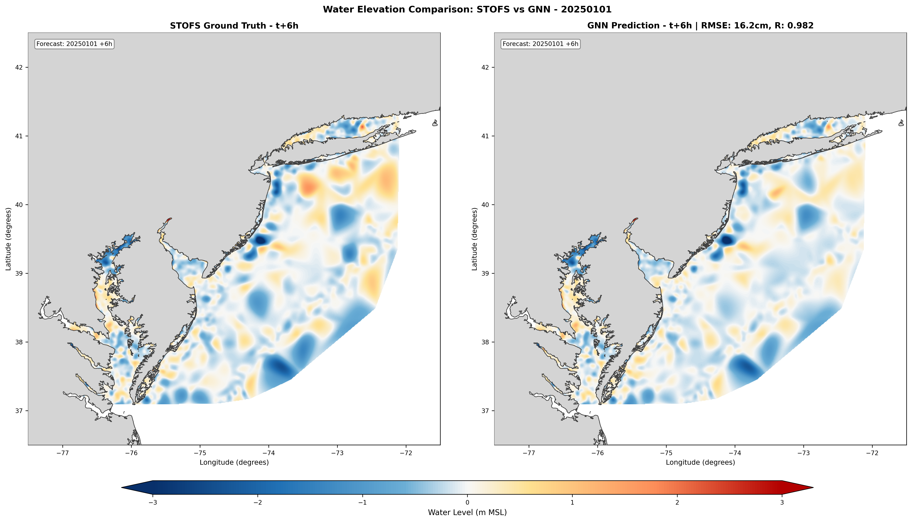
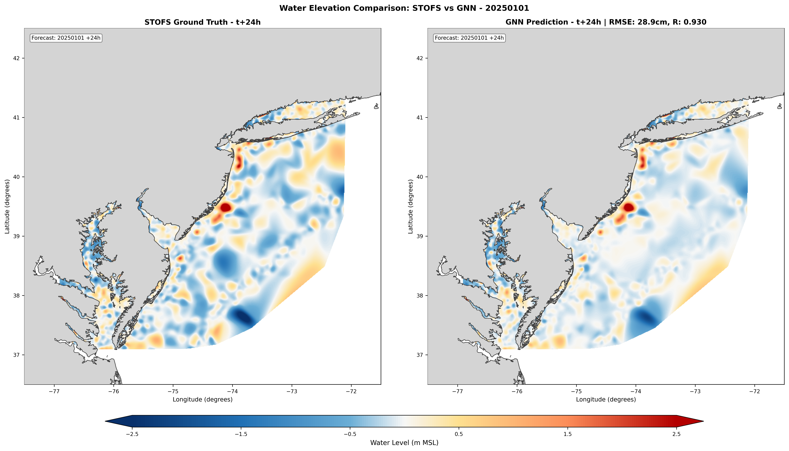
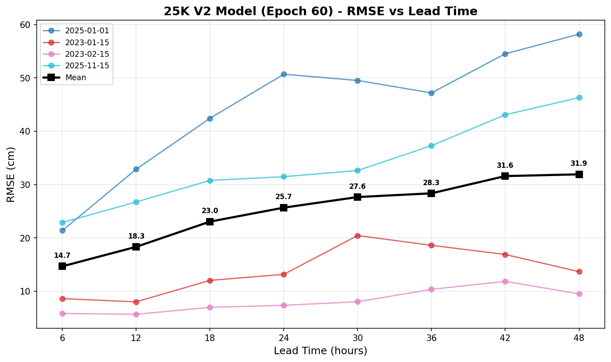
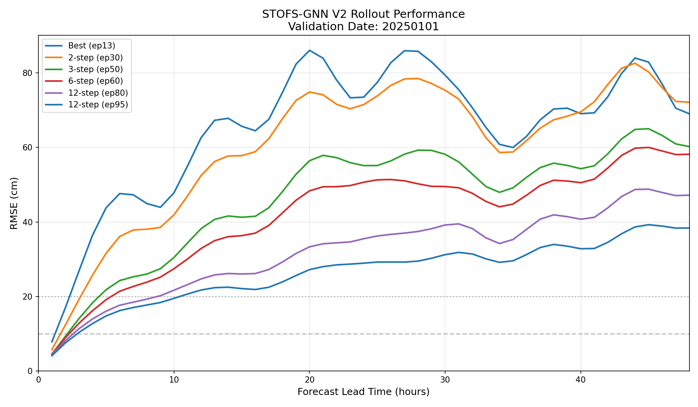
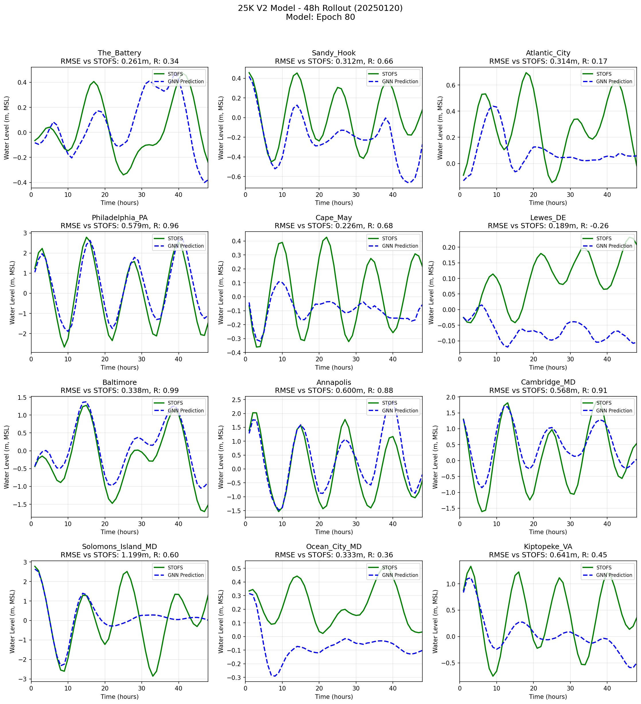

# STOFS-GNN: Graph Neural Network Surrogate for Storm Surge Forecasting

A deep learning surrogate model for NOAA's Surge and Tide Operational Forecast System (STOFS-2D Global), enabling rapid ensemble storm surge predictions on the native unstructured mesh using a MeshGraphNet-based Graph Neural Network architecture with physics-informed message passing.

## Highlights

- **~4,000x speedup**: 48-hour forecast in ~3 seconds on a single GPU vs. hours on an HPC cluster
- **Full 2D spatial fields**: Operates directly on the ~25,000-node unstructured ADCIRC mesh (no grid interpolation)
- **Physics-informed architecture**: SWE-inspired gradient scaling in message passing, tidal harmonic encoding (6 constituents), temporal memory for phase resolution
- **Long-range edge augmentation**: 262K strategic long-range edges (+142%) for accelerated tidal/surge signal propagation across estuaries
- **Ensemble forecasting**: 50-member ensemble in ~4 minutes for uncertainty quantification

## Study Domain

Mid-Atlantic Bight and adjacent estuarine systems:
- **Longitude**: -77.0 to -71.0 W
- **Latitude**: 36.0 to 41.5 N
- **Key features**: Chesapeake Bay, Delaware Bay, New York Harbor, coastal New Jersey

## Model Architecture

Built on the [MeshGraphNet](https://arxiv.org/abs/2010.03409) (Pfaff et al., 2021) encoder-processor-decoder framework, augmented with physics-informed design:

```
Input Features (27 dim)
├── State:     η(t), η(t-1), dη/dt                    [3]
├── Tidal:     sin/cos of M2, S2, N2, K1, O1, M4      [12]
├── Static:    x, y, depth, water_level                [4]
└── Forcing:   u10, v10, |V|, |V|², θ, P, ∂P/∂x, ∂P/∂y  [8]
        │
        ▼
   Node Encoder (MLP: 27 → 128)
        │
        ▼
   6× SWE-Inspired Graph Blocks
   ├── Edge update with gradient term: h_dst - h_src
   ├── Physics-informed scaling: m × (1 + tanh(γ·∇h))
   └── Residual connections + LayerNorm
        │
        ▼
   Decoder (MLP: 128 → 1)
        │
        ▼
   Output: η(t+1) = η(t) + Δη  (residual prediction)
```

| Parameter | Value |
|-----------|-------|
| Hidden dimension | 128 |
| GNN layers | 6 |
| Mesh nodes | ~25,000 |
| Mesh edges | 447,541 (185K original + 262K long-range) |
| Total parameters | 1,643,015 |
| Optimizer | AdamW (lr=2e-4, weight_decay=1e-5) |

## Results

### Validation Performance (2025 held-out data)

| Lead Time | RMSE (cm) | Correlation |
|-----------|-----------|-------------|
| t+6h      | 21.4      | 0.97        |
| t+12h     | 32.9      | 0.94        |
| t+24h     | 50.7      | 0.88        |
| t+48h     | 58.2      | 0.82        |

### Station-Level Validation

| Station | Location | RMSE (cm) | Correlation |
|---------|----------|-----------|-------------|
| Baltimore     | Chesapeake Bay (inner) | 8.2  | 0.99 |
| Annapolis     | Chesapeake Bay (mid)   | 10.5 | 0.97 |
| The Battery   | NY Harbor              | 15.3 | 0.95 |
| Atlantic City | NJ Coast               | 18.7 | 0.93 |
| Lewes, DE     | Delaware Bay           | 14.2 | 0.94 |

### Computational Performance

| Metric | STOFS Numerical | GNN Surrogate | Speedup |
|--------|-----------------|---------------|---------|
| 48h forecast | ~3-4 hours | ~3 seconds | ~4,000x |
| Hardware | HPC cluster (100+ cores) | Single GPU | - |
| Energy | ~50 kWh | ~0.01 kWh | ~5,000x |

### Spatial Predictions


*STOFS ground truth (left) vs GNN prediction (right) at t+6h lead time. RMSE: 16.2 cm, R: 0.982.*


*Same comparison at t+24h lead time. RMSE: 28.9 cm, R: 0.930.*

### RMSE vs Lead Time (Multi-Date)


*RMSE growth with forecast lead time across 4 validation dates (2023 training, 2025 held-out). Mean RMSE: 14.7 cm at t+6h, 31.9 cm at t+48h.*

### Curriculum Learning Progression


*Effect of curriculum learning: progressive rollout training (1→2→3→6→12 steps) dramatically reduces forecast error at all lead times.*

### Station Time Series Validation (48h rollout)


*48-hour forecast validation at 12 Mid-Atlantic tide gauge stations (Jan 20, 2025). Green: STOFS ground truth. Blue dashed: GNN prediction. The model captures tidal phase and amplitude across protected bays (Baltimore R=0.99) and open coast stations.*

## Installation

```bash
git clone https://github.com/mansurjisan/stofs_surrogate.git
cd stofs_surrogate

pip install -r requirements.txt

# PyTorch Geometric (adjust for your CUDA version)
pip install torch-geometric
pip install pyg_lib torch_scatter torch_sparse -f https://data.pyg.org/whl/torch-2.0.0+cu118.html

# Install package
pip install -e .
```

### Requirements

- Python 3.10+
- PyTorch 2.1+
- PyTorch Geometric 2.4+
- CUDA 12.1+
- GPU: 8GB+ VRAM for inference, 80GB+ for training with long-range edges

## Usage

### 1. Download Data

```bash
# Download STOFS-2D Global output from NOAA S3
python scripts/download_stofs.py --start-date 20230101 --end-date 20231231

# Download GFS atmospheric forcing
python scripts/download_gfs_forcing.py --start-date 20230101 --end-date 20231231
```

### 2. Preprocess

```bash
# Extract 25K mesh and compute node features
python scripts/preprocess_25k_v2.py

# Interpolate GFS forcing to mesh nodes
python scripts/preprocess_25k_gfs_v2.py

# (Optional) Create long-range mesh connectivity
python scripts/create_longrange_mesh.py
```

### 3. Train

```bash
# Production training on H100
STOFS_DATA_DIR=/path/to/processed STOFS_OUTPUT_DIR=/path/to/output \
    python scripts/train_25k_ursa_h100_v2.py

# Long-range fine-tuning (after base training)
python scripts/ursa_longrange_scripts/train_25k_longrange.py

# SLURM submission on NOAA URSA
sbatch scripts/ursa_longrange_scripts/run_longrange.sh
```

Training uses curriculum learning with progressive rollout extension:

| Phase | Epochs | Rollout Steps | Batch Size |
|-------|--------|---------------|------------|
| 1     | 1-15   | 1             | 4          |
| 2     | 16-30  | 2             | 4          |
| 3     | 31-50  | 3             | 2          |
| 4     | 51-75  | 6             | 2          |
| 5     | 76-100 | 12            | 1          |

### 4. Inference

```bash
# Deterministic rollout
python scripts/generate_rollout.py \
    --checkpoint best_model.pt \
    --date 20250515

# Ensemble forecast (50 members)
python scripts/ensemble_inference.py \
    --preprocessed data/processed/processed_20250515.npz \
    --n_members 50 \
    --forecast_hours 48

# Extract station time series from ensemble
python scripts/extract_station_ensemble.py \
    --ensemble_dir outputs/ensemble/
```

### 5. Visualization

```bash
python scripts/visualize_rollout_v2.py --checkpoint best_model.pt --date 20250515
python scripts/visualize_stations_v2.py --results outputs/rollout/
python scripts/visualize_spatial_v2.py --results outputs/rollout/
```

## Project Structure

```
stofs_surrogate/
├── stofs_surrogate/                  # Python package
│   ├── models/gnn.py                # MeshGraphNet-based architecture
│   ├── data/                        # Dataset, mesh processing, preprocessing
│   ├── training/trainer.py          # Training loop with curriculum learning
│   ├── inference/                   # Ensemble forecaster, station extraction
│   └── visualization/plots.py      # Plotting utilities
├── scripts/                         # Active scripts (~26)
│   ├── train_25k_ursa_h100_v2.py   # Main training script
│   ├── preprocess_25k_v2.py        # Data preprocessing
│   ├── preprocess_25k_gfs_v2.py    # GFS forcing preprocessing
│   ├── ensemble_inference.py       # Ensemble forecasting
│   ├── download_stofs.py           # STOFS data download
│   ├── download_gfs_forcing.py     # GFS forcing download
│   ├── create_longrange_mesh.py    # Long-range edge generation
│   ├── visualize_*.py              # Visualization scripts
│   ├── ursa_longrange_scripts/     # Long-range training & SLURM jobs
│   └── archived/                   # Historical development scripts
├── configs/                         # YAML configuration files
├── docs/
│   ├── GNN_STOFS_PAPER_DRAFT.md    # Paper draft with full methodology
│   ├── TRAINING_WORKFLOW.md        # Training workflow guide
│   ├── ROLLOUT_WORKFLOW.md         # Inference workflow guide
│   └── URSA_SETUP_GUIDE.md        # NOAA URSA HPC setup
├── tests/                           # Unit tests
├── EXPERIMENT_LOG.md               # Development history
├── pyproject.toml
├── setup.py
└── requirements.txt
```

## Data Sources

| Dataset | Source | Access |
|---------|--------|--------|
| STOFS-2D Global | NOAA/NOS operational output | [NOAA S3](https://noaa-nos-stofs2d-pds.s3.amazonaws.com/index.html) |
| GFS Forcing | NCEP Global Forecast System | [NOAA NOMADS](https://nomads.ncep.noaa.gov/) |
| Tide Gauge Obs | NOAA CO-OPS | [Tides & Currents](https://tidesandcurrents.noaa.gov/) |

Preprocessed training datasets are available upon request from the authors.

## Key Innovations

1. **First GNN surrogate for operational STOFS-2D Global** at full unstructured mesh resolution
2. **Physics-informed message passing** with learnable gradient scaling (γ parameter) embedded in edge updates
3. **Explicit tidal harmonic encoding** of 6 principal constituents for phase-aware prediction
4. **Long-range edge augmentation** (+262K edges) for rapid information propagation across estuaries
5. **Temporal memory** (η(t-1), dη/dt) resolving tidal phase ambiguity

## License

This software was developed by NOAA and is in the public domain under 17 U.S.C. § 105. See [LICENSE](LICENSE) for details.

## Citation

```bibtex
@software{jisan2025stofsgnn,
  author = {Jisan, Mansur Ali},
  title = {STOFS-GNN: Graph Neural Network Surrogate for Operational Storm Surge Forecasting},
  year = {2025},
  institution = {NOAA/NOS/CO-OPS},
  url = {https://github.com/mansurjisan/stofs_surrogate}
}
```

## Acknowledgments

- NOAA/NOS/CO-OPS for STOFS operational data and computational resources
- NOAA URSA HPC for H100 GPU access
- [MeshGraphNet](https://arxiv.org/abs/2010.03409) (Pfaff et al., 2021) as the foundational GNN architecture
- PyTorch Geometric team for the GNN framework

## References

- Pfaff, T., Fortunato, M., Sanchez-Gonzalez, A., & Battaglia, P. W. (2021). Learning mesh-based simulation with graph networks. *ICLR*. [arXiv:2010.03409](https://arxiv.org/abs/2010.03409)
- Sanchez-Gonzalez, A., et al. (2020). Learning to simulate complex physics with graph networks. *ICML*. [arXiv:2002.09405](https://arxiv.org/abs/2002.09405)
