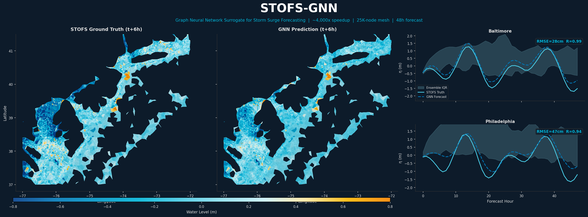
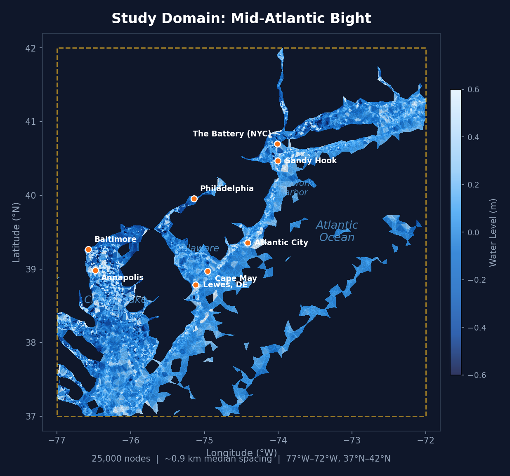
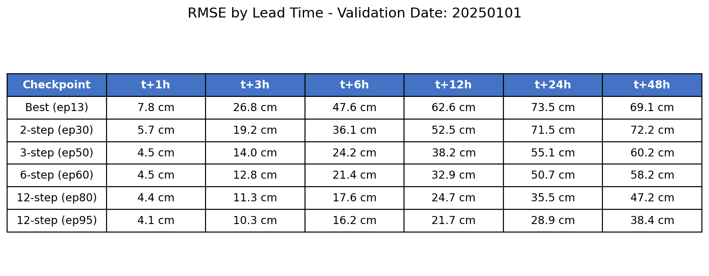
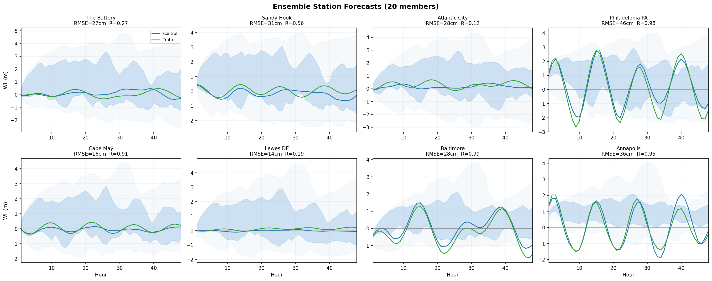

# STOFS-GNN: Graph Neural Network Surrogate for Storm Surge Forecasting

[](https://github.com/mansurjisan/stofs_surrogate/actions/workflows/ci.yml)



A physics-informed deep learning surrogate for NOAA's Surge and Tide Operational Forecast System (STOFS-2D Global), enabling 48h storm surge forecasts over the Mid-Atlantic region in ~3 seconds on a single GPU. Built on MeshGraphNet with shallow water equation (SWE)-inspired message passing.

## Highlights

- **~4,000x speedup** over numerical model (48h forecast in ~3 seconds on a single GPU)
- **25,000-node subsampled mesh** from the STOFS-2D Global unstructured grid (7.4% of ~340K native nodes in domain)
- **Physics-informed GNN** with SWE-inspired gradient scaling, 6-constituent tidal encoding, and temporal memory
- **Long-range edge augmentation** (+262K edges) for tidal/surge signal propagation across estuaries

## Study Domain



Mid-Atlantic Bight (-77 to -72 W, 37 to 42 N): Chesapeake Bay, Delaware Bay, New York Harbor, and coastal New Jersey. The native STOFS-2D Global mesh has 12.8M nodes globally; the surrogate operates on a ~25K-node regional subset with median edge spacing of ~0.9 km (vs ~0.17 km native).

## Model Architecture

A physics-informed GNN built on [MeshGraphNet](https://arxiv.org/abs/2010.03409) (Pfaff et al., 2021). The graph blocks incorporate shallow water equation (SWE) physics through bathymetric gradient scaling, which modulates message passing strength based on local depth gradients — amplifying information flow in regions of steep bathymetry where surge dynamics are most active.

```
Input (27 features per node)
├── State:    η(t), η(t-1), dη/dt                       [3]
├── Tidal:    sin/cos of M2, S2, N2, K1, O1, M4         [12]
├── Static:   x, y, depth, water_level                   [4]
└── Forcing:  u10, v10, |V|, |V|², θ, P, ∂P/∂x, ∂P/∂y  [8]
    → Node Encoder (MLP: 27 → 128)
    → 6× SWE Graph Blocks with gradient scaling: m × (1 + tanh(γ·∇h))
    → Decoder (MLP: 128 → 1)
    → η(t+1) = η(t) + Δη
```

~1.6M parameters.

## Training

| | |
|---|---|
| **Training data** | STOFS-2D Global daily forecasts, Jan 2023 – Dec 2024 (~700 days) |
| **Validation data** | Jan 2025 – present (held-out year) |
| **Hardware** | NVIDIA H100 80GB (NOAA URSA HPC) |
| **Training time** | ~2–3 weeks (100 epochs with curriculum rollout) |
| **Optimizer** | AdamW (lr=2e-4, weight decay=1e-5) |
| **Scheduler** | Cosine annealing (η_min=1e-6) |
| **Precision** | Mixed (AMP) |
| **Effective batch** | 64 (batch=4 × grad accumulation=16) |
| **Curriculum** | Rollout steps 1→2→3→6→12 over 100 epochs |
| **Inference** | ~3 seconds for 48h forecast (single GPU) |

## Results

### Validation (2025 held-out data, epoch 95)

| Lead Time | RMSE (cm) |
|-----------|-----------|
| t+1h      | 4.1       |
| t+6h      | 16.2      |
| t+12h     | 21.7      |
| t+24h     | 28.9      |
| t+48h     | 38.4      |

### Spatial Predictions


*STOFS ground truth (left) vs GNN prediction (right) at t+6h. RMSE: 16.2 cm, R: 0.982.*


*Same at t+24h. RMSE: 28.9 cm, R: 0.930.*

### Curriculum Learning Progression


*Progressive rollout training reduces 48h RMSE from 69 cm (early) to 38 cm (epoch 95).*



### Station Validation (48h rollout, Jan 20 2025)


*Green: STOFS ground truth. Blue dashed: GNN prediction. Strong tidal phase capture in protected bays (Baltimore R=0.99, Philadelphia R=0.98, Annapolis R=0.95).*

### Ensemble Uncertainty Quantification (20 members)


*20-member ensemble via perturbed meteorological forcing (wind, pressure) and initial conditions. Blue: GNN control forecast. Green: STOFS truth. Shading: ensemble spread. Strong skill in protected bays (Baltimore R=0.99, Annapolis R=0.95); wider spread at exposed coastal stations reflects forcing sensitivity.*

## Experiment tracking

Training runs are tracked through a small backend-agnostic abstraction
(`stofs_surrogate/training/tracking.py`) with **MLflow** as the default (Weights & Biases
optional). Each run logs the resolved config, per-epoch train/val loss and learning rate,
the git commit SHA (for lineage), and the final model checkpoint as an artifact.

Verify the full pipeline end-to-end on CPU with synthetic data — no GPU or NOAA data needed:

```bash
pip install -e ".[dev]"                      # includes mlflow
python scripts/smoke_train.py                # ~2 epochs of synthetic data -> ./mlruns
MLFLOW_ALLOW_FILE_STORE=true mlflow ui       # browse the "stofs-smoke" experiment at localhost:5000
```

Choose the backend per run with `--tracker mlflow` (default), `--tracker wandb`, or
`--tracker none`.

## Inference and model registry

Reusable inference lives in `stofs_surrogate/inference/`: `Predictor` loads a checkpoint
and runs an autoregressive rollout, and `EnsemblePredictor` runs a perturbed-forcing
ensemble with mean/std/percentile statistics.

```python
from stofs_surrogate.inference import Predictor

predictor = Predictor.from_checkpoint("outputs/checkpoints/best_model.pt")
forecast = predictor.rollout(state, node_features, edge_index, edge_attr, num_steps=48)
```

Trained models are registered in the MLflow Model Registry with full lineage — git SHA,
config, validation metrics, and a training-data manifest hash:

```bash
python scripts/register_model.py --checkpoint best_model.pt \
    --tracking-uri sqlite:///mlflow.db --name stofs-gnn-midatlantic --alias staging
```

(The production 25k rollout/ensemble scripts embed their physics-informed model inline;
migrating them onto `Predictor` is tracked as follow-up.)

## Serving

A FastAPI service (`stofs_surrogate/serving/app.py`) wraps the `Predictor`: `GET /health`,
`GET /metadata` (model identity, git SHA, registry skill), `POST /predict`, and
`POST /predict/batch`. With no model configured it serves a small synthetic demo model, so
it runs without a checkpoint.

```bash
docker build -f Dockerfile.serve -t stofs-gnn-serve .
docker run --rm -p 8000:8000 stofs-gnn-serve            # or: uvicorn stofs_surrogate.serving.app:app
curl localhost:8000/health
```

Point it at a trained model with `STOFS_MODEL_CHECKPOINT` / `STOFS_MODEL_KWARGS` (and
`STOFS_REGISTRY_URI` + `STOFS_REGISTRY_MODEL` to surface registry skill in `/metadata`).
CPU inference on the subsampled mesh is interactive (sub-second for a short rollout on the
demo model); a full 48h forecast on the 25K-node mesh is GPU-accelerated.

## Monitoring and drift

Water level has real ground truth (NOAA CO-OPS tide gauges), so forecasts can be scored
against observations. `stofs_surrogate/monitoring/` computes rolling RMSE / correlation /
bias per station (`skill.py`) and flags skill degradation past a threshold, and reports
input/prediction drift (`drift.py`, KS test + PSI — with a richer Evidently report when
`.[monitoring]` is installed). `scripts/monitor.py` runs the whole loop and emits Prometheus
metrics:

```bash
python scripts/monitor.py     # -> outputs/monitoring/{drift_report.html, metrics.prom}
```

The observations client has a synthetic fallback for CI/offline; the live CO-OPS pull (via
`searvey`) is a documented `TODO(user)`.

## Infrastructure

`infra/terraform/` provisions the serving stack on AWS (S3 for artifacts + data, ECR, an
EC2 inference host, CloudWatch). It is **validate/plan only** — CI runs `terraform fmt`,
`init -backend=false`, and `validate` (no credentials, no `apply`). See
[`infra/README.md`](infra/README.md) for the cost warning and usage.

## Repository Structure

- `stofs_surrogate/` — Python package (model, data, training, inference, visualization)
- `configs/` — Training and ensemble configuration (architecture + hyperparameters)
- `scripts/` — Training, preprocessing, rollout, and visualization scripts
- `docs/figures/` — Result figures used in README

See [`docs/REPO_STRUCTURE.md`](docs/REPO_STRUCTURE.md) for the full package layout. Earlier development scripts are preserved on the `dev-history` branch.

Training requires STOFS-2D Global output ([NOAA S3](https://noaa-nos-stofs2d-pds.s3.amazonaws.com/index.html)) and GFS forcing ([NOAA NOMADS](https://nomads.ncep.noaa.gov/)). Preprocessed data available upon request.

## License

Public domain (17 U.S.C. § 105). See [LICENSE](LICENSE).

## Citation

```bibtex
@software{jisan2025stofsgnn,
  author = {Jisan, Mansur Ali},
  title = {STOFS-GNN: Graph Neural Network Surrogate for Operational Storm Surge Forecasting},
  year = {2025},
  institution = {NOAA/NOS/CO-OPS},
  url = {https://github.com/mansurjisan/stofs_surrogate}
}
```